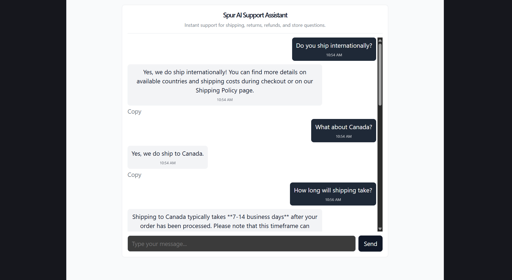

# Spur AI Support Assistant

Production-quality AI customer support chatbot for a fictional e-commerce store.

## Features

* Real-time chat interface
* Conversation persistence across refreshes
* Context-aware AI responses
* Shipping, returns, refunds and support FAQs
* PostgreSQL message storage
* Redis conversation caching
* Robust error handling
* Session-based conversations
* Input validation using Zod

---

## How Requests Flow Through The System

Frontend (React + TypeScript)
           ↓
Backend API (Express + TypeScript)
           ↓
Redis Cache (Upstash)
           ↓
PostgreSQL Database (Neon)
           ↓
Google Gemini 2.5 Flash


## Why this Architecture?

- PostgreSQL acts as the source of truth for all conversations.
- Redis is used purely as a cache layer to improve retrieval performance.
- Gemini integration is isolated behind GeminiService, making it easy to switch to OpenAI or Claude later.
- Business logic lives in services while controllers remain thin.
---

## Built With

### Frontend

* React
* TypeScript
* Vite

### Backend

* Node.js
* Express
* TypeScript

### Database

* PostgreSQL
* Prisma ORM

### Cache

* Redis (Upstash)

### LLM

* Google Gemini 2.5 Flash

---

## Project Structure Tree

Backend/src/
├── controllers/
├── services/
├── repositories/
├── routes/
├── validators/
├── middleware/
├── types/
├── utils/
├── app.ts
└── server.ts

Frontend/src/
├── components/
├── pages/
├── assets/
├── App.tsx
├── main.tsx
├── App.css
└── index.css
---

### Deployment Targets

* Frontend → Vercel
* Backend → Render
* Database → Neon
* Redis → Upstash

---

## Local Setup

### Clone Repository

```bash
git clone <repository-url>
cd "Spur AI Live Chatbot"
```

### Backend Setup

```bash
cd Backend
npm install
npm run prisma:generate
npm run prisma:migrate
npm run dev
```

Backend runs on:

```text
http://localhost:4000
```

### Frontend Setup

```bash
cd Frontend
npm install
npm run dev
```

Frontend runs on:

```text
http://localhost:5173
```

---

## Backend Environment Variables

Create `Backend/.env`

```env
PORT=4000
DATABASE_URL=your_postgresql_connection_string
REDIS_URL=your_upstash_redis_url
GEMINI_API_KEY=your_gemini_api_key
CORS_ORIGIN=http://localhost:5173
```

---

## Frontend Environment Variables

Create `Frontend/.env`

```env
VITE_API_BASE_URL=http://localhost:4000/api
```

---

## API Endpoints

### Health Check

```http
GET /health
```

Response:

```json
{
  "status": "ok"
}
```

### Send Message

```http
POST /api/chat/message
```

Request:

```json
{
  "message": "Do you ship internationally?",
  "sessionId": "optional-session-id"
}
```

Response:

```json
{
  "reply": "Yes, we ship internationally...",
  "sessionId": "generated-session-id"
}
```

### Fetch Conversation History

```http
GET /api/chat/history/:sessionId
```

---

## Demo Screenshot



## Database Schema

### Conversation

* id
* sessionId
* createdAt

### Message

* id
* conversationId
* sender
* content
* createdAt

---

## Assignment Requirements Coverage

✅ Live chat interface
✅ Conversation persistence
✅ PostgreSQL message storage
✅ Redis caching
✅ Session management
✅ Gemini LLM integration
✅ Store FAQ knowledge
✅ Input validation
✅ Error handling
✅ Context-aware responses

---

## Engineering Notes

A deliberate decision was to keep PostgreSQL as the single source of truth and use Redis only as a cache layer. This keeps conversation recovery simple and prevents cache failures from affecting persistence.

The Gemini integration lives entirely inside `GeminiService`, so swapping to OpenAI or Claude later would require changes in only one place.

I intentionally avoided introducing LangChain, RAG pipelines, or vector databases because they add complexity without providing much value for a support FAQ chatbot of this size.

---

## If I had more time

The next thing I would add would probably be response streaming so replies appear token-by-token rather than all at once.

After that I'd likely add an internal dashboard showing common customer questions and conversation analytics.

Longer term, the current service boundaries should make it relatively straightforward to support additional channels such as WhatsApp or Instagram without major backend changes.

---

## Trade-offs

For this assignment I chose to persist full conversation history in PostgreSQL while limiting the context sent to Gemini to the latest messages only.

This keeps costs predictable while preserving the complete conversation record for future retrieval or analytics.

---

## What I Optimized For

- Simple deployment
- Clear separation of concerns
- Graceful failure handling
- Minimal infrastructure complexity

